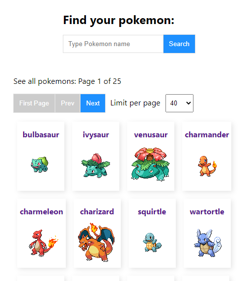

# Pokemons info

#### Link to the demo [ Pokemons info](https://parfum505.github.io/pockemon-react-typescript/ "Pokemons info")

### About Pokemons info:

- Pokemons info uses The RESTful Pokémon API [Pokémon API](https://pokeapi.co/ "Pokémon API")
- All the Pokémon data you'll ever need in one place
